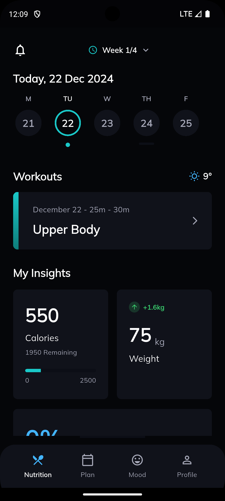
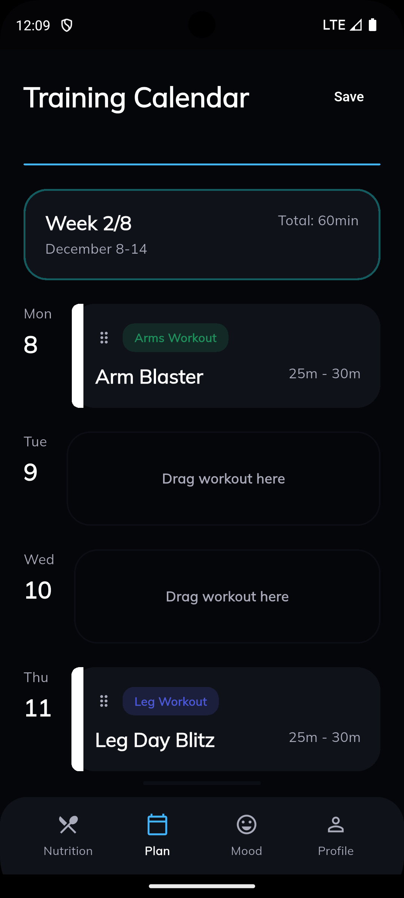

## 1) Dependencies Used & Why

- google_fonts: ^6.3.2 — used to load and use Google Fonts easily across the app (improves typography without bundling font files).

## 2) Project Structure

High level project layout and purpose of main directories/files.

```
lib/
 ├── main.dart            # app entrypoint
 ├── presentation/       # UI layer: screens, widgets, navigation
 │   ├── home/
 │   ├── mood/
 │   ├── navigation/
 │   ├── plan/
 │   ├── profile/
 │   └── widgets/
 └── theme/              # app theme, colors, styles (app_theme.dart, app_colors.dart)
```

## 3) App Screenshots







## 4) App Video

https://drive.google.com/drive/folders/1FmKwoEioUGafzt9K-rOvHJHT1M-Orjrn?usp=share_link


## 5) App APK

https://drive.google.com/drive/folders/1Jy11cpXbh3Z-PECFJlpiafwvbC71CRyv?usp=share_link


# test_task
